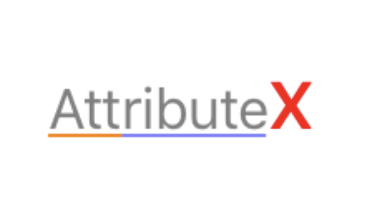
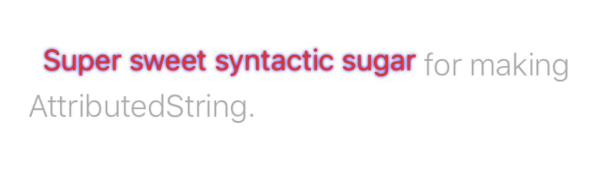

# AttributeX


[](https://github.com/Carthage/Carthage)

✨ Super sweet syntactic sugar for making strongly-typed AttributedString.

## At a Glance

Set attributes with `CountableClosedRange`

```swift
let mAttString = NSMutableAttributedString(string: "AttributeX")
 mAttString[0...9].foregroundColor = UIColor.gray
 mAttString[0...9].underlineStyle = .styleSingle
 mAttString[0...3].underlineColor = UIColor.orange
 mAttString[3...9].underlineColor = UIColor.blue.withAlphaComponent(0.5)
 mAttString[9...10].foregroundColor = UIColor.red
 mAttString[9...10].font = UIFont.boldSystemFont(ofSize: 20)
 label.attributedText = mAttString
```
this can get:





## Work with Slice

```swift
let detailString = NSMutableAttributedString(string: " Super sweet syntactic sugar for making AttributedString.")
 let syntacticSlice = detailString[2...29]
 syntacticSlice.foregroundColor = UIColor.red

 syntacticSlice.shadow = {
	let shadow = NSShadow()
	shadow.shadowColor = UIColor.blue
	shadow.shadowBlurRadius = 2
	return shadow
 }()

 let endSlice = detailString[29...detailString.length]
 endSlice.baselineOffset = -3
 endSlice.foregroundColor = UIColor.lightGray
 endSlice.font = UIFont.systemFont(ofSize: 18, weight: .thin)
 detailLabel.attributedText = detailString
```

